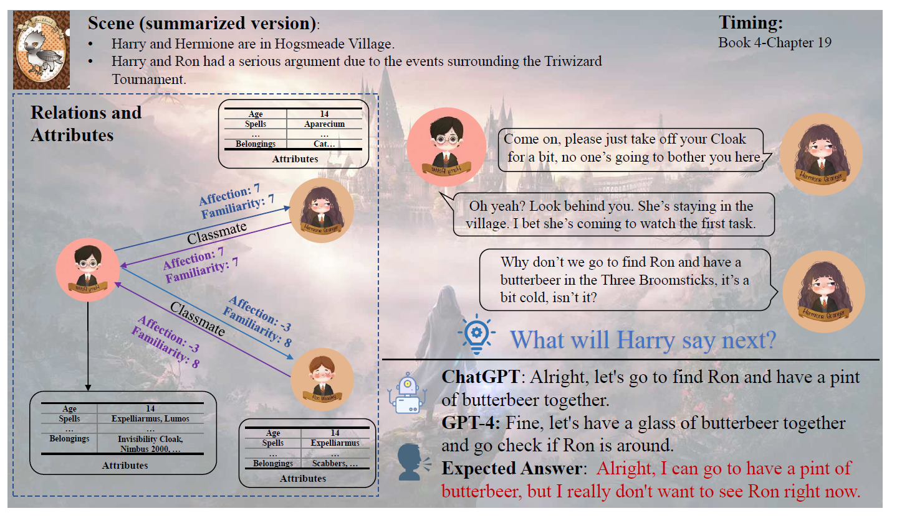
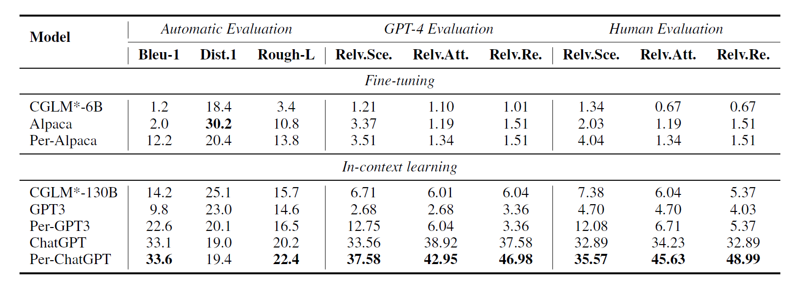
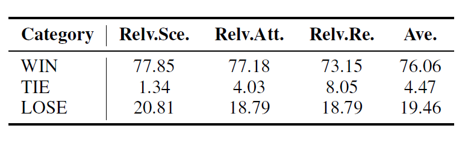
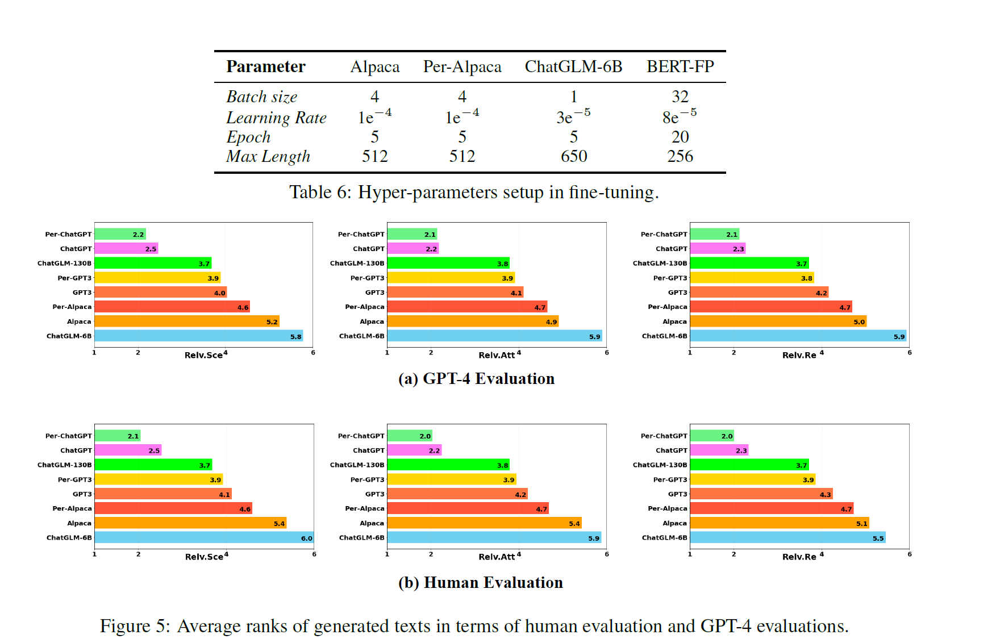
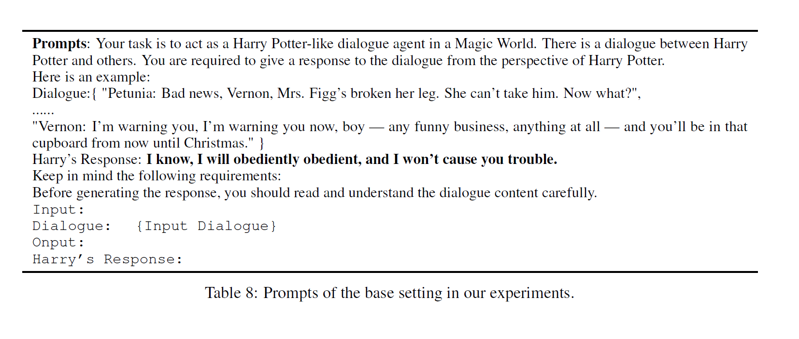
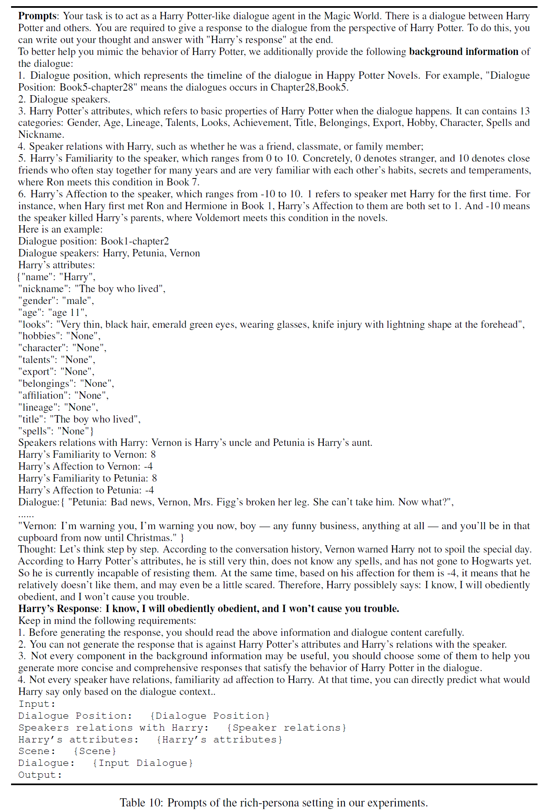

# Large Language Models meet harry potter

## Summary

## Align agent with specific character

- ChatGPT와 같은 dialogue style 의 LLM 모델들이 많이 개발되었지만 특정 캐릭터에 맞춰 답변하도록 만드는 것에는 여러가지 어려움이 있음
- extensive annotation 을 통해 이러한 문제를 해결해보려 함
- 소설 해리 포터를 사용하여 이러한 방법들이 얼마나 효과적인지 보여주려 함. 이를 위해 데이터셋도 만들었는데, 함께 공개함.

논문의 주요 Challenges

- LLM 은 real-world knowledge 를 이미 많이 가지고 있음 -> 스토리 라인 상 character 가 가지는 설정들에 부합하지 못하는 결과물들을 생성함
  - hallucination 문제
- 복잡한 인간 관계를 잘 이해하지 못하는 문제점. 특히 여러 관계를 동시에 가지는 경우에 어려움을 보임(friendship, romantic partnership and competitor).
- 시간의 흐름에 따른 관계 및 설정의 변화를 이해하지 못하는 문제점.
  - 기존의 데이터 셋들 또한 스토리 전개에 따른 변화를 적절하게 포함하지 못하는 문제를 가지고 있었음.

이러한 문제를 해결하기 위해 대화를 단위로 그에 맞는 background 에 대한 정보들을 모음
- background 에는 dialogue scenes, speakers, character relationships and attributes 등이 있음
  - 해리를 중심으로 12 개의 relationship과 13개의 attribute 로 레이블링 함
  - 대화에 참여하는 참여자가 동일하더라도 스토리의 전개에 따라 다르게 레이블링 될 수 있음.
- 실험 결과를 통해 이러한 추가 정보들이 LLM 의 생성을 도와줄 수 있음을 확인함

Task definition

aim of aligning dialogue agents

대화에 있어 Harry 에게 영향을 미치는 요소들
- conversation history(가장 중요한 요소)
- scene: 대화가 일어나는 상황에 대한 묘사
  - Hermione invites Harry to have a butterbeer with Ron in the Three Brromsticks
- partificipant's informantion; attributes and relations

y = argmax P(Y | H, S, P)

Dataset Construction

- Harry 가 참여하는 모든 대화들을 수집함

Training Set
- 모든 multi-turn 대화들을 수집해 줄 것을 요청함
- 각 발화의 speaker 정보도 함께 레이블링 함

Test Set
- kwoledge leakage problem; 즉 pre-training 때 해당 대화를 이미 학습했을 가능성이 존재한다. test set 을 구성할 때에는 이러한 문제를 막기 위해 노력했다.
- 다음의 조건을 만족하는 대화들을 따로 수집하고, 이를 test set 으로 사용했다.
  - 단 한 명의 발화자만 있는 대화
  - 마지막 질문애 대한 답이 없는 채로 끝난 대화
- 이러한 조건을 만족하는 대화를 수집하고, 그것에 대한 Harry 의 예상 답변을 생성하여 이를 label 로 사용했다.
  - 해리포터 전문가들로 구성된 annotator 들이 예상 답변을 만들도록 할 수도 있겠지만, In context learning + GPT-4를 사용하여 복수의 답변을 생성하고, 그것들 중 가장 적절해 보이는 것을 고르는 식으로 했다.
  - 이를 통해 positive 뿐만 아니라 negative 샘플도 확보할 수 있었다.

Scene Construction
- Scene 에 대한 내용들을 소설에서 먼저 수집하고, GPT-4 를 통해 이를 요약하도록 함
- 요약된 내용들은 전문적인 annotator 들이 교정한 후에 데이터 셋에 포함함
  - 요약을 하지 않는 경우 input limit 을 넘는 경우들이 생김

Attribute and relations construction

13 개의 attribute 와 12 개의 relation 으로 분류함

attribute
- inborn 과 nurture 나눔. 총 13개임
  - inborn: Gender, Age, Lineage, Talents, and Looks
  - nurture: Achievement, Title, Belongings, Export, Hobby, Character, Spells and Nickname

relations
- binary relation : Friend, Classmate, Teacher, Family, Lover, Opponent, Teammate, Enemy
  - 한 번에 복수 개의 관계를 가질 수 있으므로 binary 로 표현
- discrete relations: 
  - (1) Harry’s Familiarity with someone
  - (2) Harry’s Affection for someone
  - (3) someone’s Familiarity with Harry,
  - (4) someone’s Affection for Harry.
- Familiarity 는 -10 에서 10까지 21 단계로, Affection은 0에서 10까지 총 11 단계로 구성됨
  - Draco 는 Harry 를 잘 알지만(familarity), 해리를 적대시한다(Affection)
  - Dumbledore 는 Harry 를 잘 알고, 애정을 가지고 있지만, 반대로 Harray 는 Dombledore 에 대해 잘 알지 못한다.
  
experiments

Models
- fine-tune: Alpaca(6B), ChatGLM-6B
- in-context: GPT3, ChatGPT(gpt3.5-turbo), ChatGLM(chat-glm-130B)

settting
- base settting: Task에 대한 설명, 하나의 대화 예시, 대화 기록만 학습에 사용
- rich-persona setting(Per-Modl): in-context learning 시 base setting 과 함께 데이터 셋의 모든 정보들을 함께 넣어줌

Evaluation
- 세 가지 방법으로 평가함
  - reference-based
    - Rough-L, Bleu-1 을 사용하여 평가함
  - GPT-4 based
    - 세 가지를 기준으로 평가함
      - Relv.Sec: Relevance with the Scene
      - Relv.Att: Relevance with the Attribution
      - Relv.Re: Relevance with the relations
    - generated text 들에 대해 랭크를 메기는 식으로 정함
  - human-based
    - GPT-4가 매긴 랭크를 확인하고 수정하는 방식으로 평가함

Result
- GPT-4와 Human based 평가에서 rich persona 모델들이 base setting 의 모델들에 비해 성능이 더욱 좋게 나왔다.
- 사람과의 대결에서는 여전히 사람이 더욱 잘하는 모습을 보였다.
  - 사람보다 잘한 경우는 30%에 그쳤다.
  - Specific character 에 align 하도록 만드는 것은 여전히 쉽지 않다.

